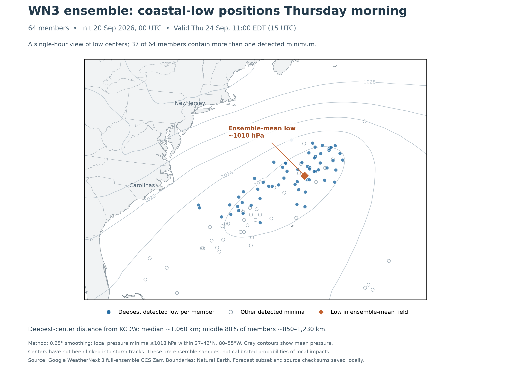

# WN3 individual ensemble members: access verified and data retrieved

Our existing identity can read the full WN3 ensemble from `gs://weathernext3_spatial/weathernext_3_0_0/zarr/`. This is separate from the `weathernext3_statistics_spatial` bucket used for the earlier mean charts. [Google's GCS guide](https://developers.google.com/weathernext/guides/gcs) documents the raw 64-member ensemble and its requester-pays requirement.

**Retrieved:** all 64 members of mean sea-level pressure, initialized September 20, 2026 at 00 UTC, valid September 24 at 13–18 UTC (09:00–14:00 EDT), hourly. This includes the expected 10:00–12:00 EDT flight. The retained region is 26–48°N and 85–50°W on the native 0.1° grid. Each member file stores pressure in Pa with explicit member identity, coordinates, and valid times.

## Verified access and transfer

- Raw pressure dimensions: `[sample=64, lead_time=60, lead_subtime=6, lat=1801, lon=3600]`.
- Actual pressure chunks: `[1, 1, 6, 1801, 3600]`. Each contains a **global six-hour block for one member**. Geographic slicing reduces retained data, but cannot reduce transfer for this chunk layout.
- The decoded coordinate values are six-hour leads 6–360 and subtime offsets −5 through 0. The chosen outer lead is 114 hours, yielding hourly leads 109–114. Member IDs are 0–63.
- All 64 source objects were present. Verified compressed transfer: **7,193,613,776 bytes (6.70 GiB)**. Retained regional member files: **79,717,978 bytes (79.7 MB)**.
- Requester-pays reads used the existing project `aviation-486817`; no account, project, billing configuration, or cloud compute instance was created. At Google's published $0.12/GiB general egress rate for U.S. destinations, the transfer estimate is about **$0.80**, plus negligible read operations. This is a rate-based estimate, not an observed bill. [Storage pricing](https://cloud.google.com/storage/pricing)
- Both 00Z and 06Z run metadata were readable. Only the 00Z forecast chunks were selected and downloaded here; readable 06Z metadata alone does not establish forecast completeness.

## Validation

Every member passed compressed-object CRC32C, decoded size, array layout, member ID, coordinate, time, and finite-pressure checks. Original object generation, size, CRC32C, source SHA-256, and subset SHA-256 are recorded per member.

The reconstructed 64-member mean at Thursday 18 UTC agrees with the previously downloaded statistics Zarr across all **77,571 regional grid points**, with maximum difference **0.00059 hPa**. At KCDW, all six hourly reconstructed means also match the previously cached BigQuery values to better than 0.00022 hPa. No new BigQuery query was used. Full numerical results are in `validation.json`.

## Initial coastal-low check

At Thursday 11:00 EDT, all 64 members have at least one detected low within the specified search domain. The deepest detected centers have a median distance of about 1,060 km from KCDW; the middle 80% of member distances spans about 850–1,230 km. This first snapshot supports an offshore solution during the flight window rather than revealing a hidden cluster close to New Jersey.

However, **37 members have multiple minima**. These centers have not been associated into storm tracks. The diagnostic smooths each pressure field over a 0.25° standard deviation, finds local minima ≤1018 hPa within 27–42°N / 80–55°W, and selects the deepest minimum in that domain. All secondary minima are retained in `center-diagnostics.json`. The member distribution is not a calibrated probability of wind, ceilings, or other impacts at KCDW.

A multi-day track analysis can use this same raw source while preserving member identity across forecast blocks. Because the chunks are global, each additional six-hour pressure block for all members is approximately another 7 GB at the sampled compression ratio. For a larger extraction, computing and cropping near the bucket in `us-east1` would avoid the large external transfer; it would still require reading the full source chunks and incur compute costs.

## Files and reproduction

- `member-00-pressure.npz` through `member-63-pressure.npz`: six hourly regional pressure grids each.
- Matching `.json` files: immutable source identity and download/subset hashes.
- `pressure-member-manifest.json`, `coordinates.npz`, and the saved `zarr.json` files: original schema, coordinates, and object inventory.
- `regional-ensemble-summary.npz`: reconstructed hourly regional means and all 64 KCDW pressure series.
- `probe_access.py`, `probe_members.py`, `fetch_pressure_members.py`, `validate_members.py`, `diagnose_centers.py`, `plot_members.py`: extraction, validation, and initial diagnostic scripts.

The scripts use the project's existing runtime credentials and optional chart dependencies. Completed member subsets are checksum-checked and reused on rerun. These files are preserved as manual research, separate from the published forecast report. The compact repository archive omits the 64 regional pressure grids; the complete 82 MB local bundle is recorded in the archive manifest.
