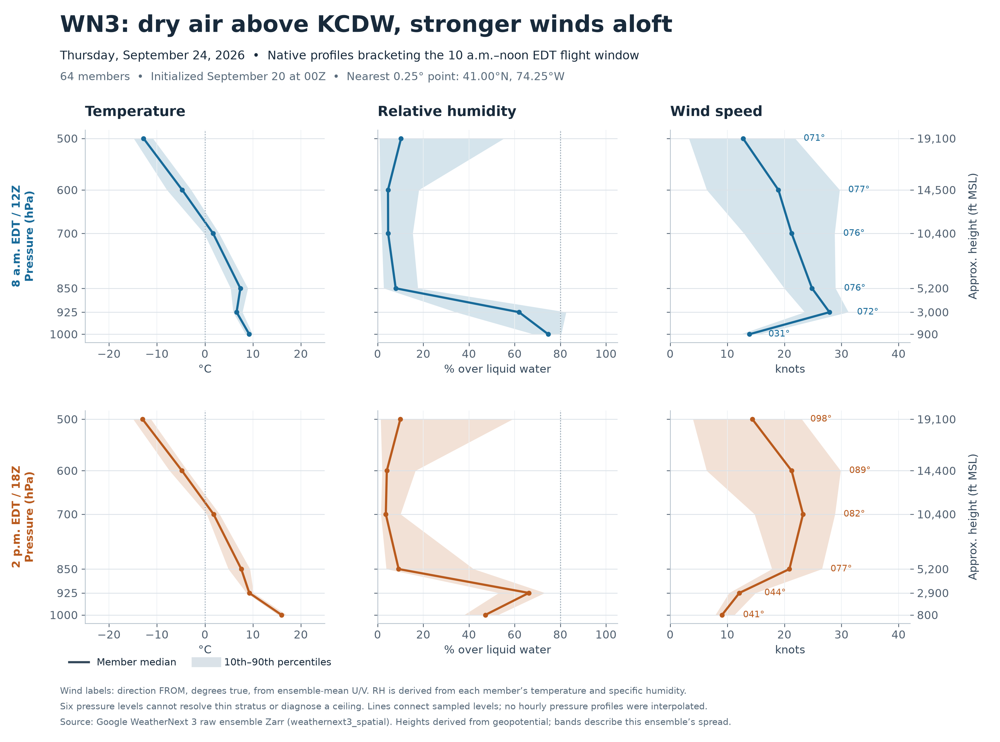

# WN3 pressure-level profiles over KCDW

The September 20 00Z ensemble supports a relatively dry lower-tropospheric scenario for Thursday, September 24, but it also shows substantial morning winds aloft. The key uncertainty during the 10 a.m.–noon EDT flight window is the timing of the low-level wind decrease and whether shallow cloud develops beneath the dry layer.

These are actual raw Zarr profiles for all 64 members at 8 a.m. and 2 p.m. EDT (12Z and 18Z), the native six-hourly times bracketing the flight. They are not an hourly forecast or a refreshed model cycle.



## What changes the interpretation

- **Wind:** At roughly 3,000 ft MSL, median wind decreases from 28 kt at 8 a.m. to 12 kt at 2 p.m.; the respective 10th–90th percentile ranges are 24–31 and 10–15 kt. Direction changes from 072° to 044° true. At about 5,200 ft MSL, easterly winds remain 25 kt and 21 kt. The six-hourly profiles do not establish when the decrease reaches KCDW during the flight window. These are winds at altitude, not surface gust forecasts.
- **Moisture/cloud:** Median RH at 925 hPa is 62% in the morning and 66% in the afternoon. At 850 hPa it is only 8–9%, with similarly dry median values at 700 and 600 hPa. That supports limited deep cloud through the sampled lower and middle troposphere. It does not exclude a shallow stratus layer below the dry air. Three of 64 members reach 90% RH at 925 hPa at 8 a.m.; one reaches 90% at 850 hPa at 2 p.m. These are member counts at sampled levels, not ceiling probabilities.
- **Temperature/stability:** At 8 a.m., 45 of 64 members warm between 925 and 850 hPa, a weak inversion above the more humid air. Such a cap could confine shallow moisture. Median temperatures near 3,000–5,200 ft are about +7°C in the morning, rising to +9°C and +8°C by 2 p.m. The first interpolated freezing crossing is around 11,500 ft MSL at both times, with a roughly 10,200–12,500 ft morning and 10,700–12,400 ft afternoon 10th–90th range. This coarse thermal diagnostic does not diagnose icing.

## Native profiles

Values below are member medians; brackets show the 10th–90th percentiles. Directions are from ensemble-mean U/V, in degrees true. Heights are geopotential feet MSL and vary by member.

### 8 a.m. EDT / 12Z

| Pressure | Height MSL | Temperature | RH over water | Wind |
|---|---:|---:|---:|---:|
| 1000 hPa | 853 ft | +9.2°C [+8.5, +9.9] | 75% [68, 80] | 031° / 14 kt [12, 16] |
| 925 hPa | 2,966 ft | +6.6°C [+5.9, +7.8] | 62% [34, 83] | 072° / 28 kt [24, 31] |
| 850 hPa | 5,247 ft | +7.4°C [+5.4, +9.0] | 8% [3, 18] | 076° / 25 kt [20, 29] |
| 700 hPa | 10,437 ft | +1.7°C [-0.2, +3.0] | 5% [2, 15] | 076° / 21 kt [13, 29] |
| 600 hPa | 14,454 ft | -4.7°C [-7.9, -2.9] | 5% [1, 18] | 077° / 19 kt [6, 30] |
| 500 hPa | 19,089 ft | -12.8°C [-14.9, -10.8] | 10% [1, 55] | 071° / 13 kt [3, 22] |

### 2 p.m. EDT / 18Z

| Pressure | Height MSL | Temperature | RH over water | Wind |
|---|---:|---:|---:|---:|
| 1000 hPa | 800 ft | +16.0°C [+15.3, +17.0] | 47% [38, 53] | 041° / 9 kt [8, 11] |
| 925 hPa | 2,949 ft | +9.2°C [+8.7, +10.1] | 66% [53, 73] | 044° / 12 kt [10, 15] |
| 850 hPa | 5,233 ft | +7.6°C [+4.9, +9.4] | 9% [4, 42] | 077° / 21 kt [18, 27] |
| 700 hPa | 10,430 ft | +1.8°C [+0.4, +3.1] | 4% [1, 10] | 082° / 23 kt [15, 29] |
| 600 hPa | 14,449 ft | -4.8°C [-7.4, -3.7] | 4% [2, 17] | 089° / 21 kt [6, 30] |
| 500 hPa | 19,072 ft | -13.0°C [-15.0, -11.2] | 10% [1, 59] | 098° / 14 kt [4, 23] |

## Cloud-cover cross-check during the flight

The cached hourly cloud-cover summaries from this same run provide complementary context. They are at the 0.1° point 40.9°N, 74.3°W; the pressure profiles are at 41.0°N, 74.25°W. These marginal summaries cannot be paired with individual pressure members.

| EDT | Mean low cloud | Low cloud p90 | Mean high cloud | Mean total cloud | Mean 10 m wind |
|---|---:|---:|---:|---:|---:|
| 10:00 | 5.6% | 19.4% | 38.5% | 42.5% | 8.4 kt |
| 11:00 | 11.2% | 39.4% | 42.6% | 49.1% | 8.6 kt |
| 12:00 | 14.8% | 69.9% | 44.3% | 51.1% | 8.1 kt |

WN3 is optimistic about low cloud in its average forecast, but the noon low-cloud p90 is about 70%. High cloud is also present in the separate cloud forecast. A dry 850 hPa level therefore should not be read as a clear-sky or ceiling guarantee.

## Source, method and limits

- **Available fields:** Temperature, specific humidity, U/V winds, geopotential and vertical velocity on 13 pressure levels: 1000, 925, 850, 700, 600, 500, 400, 300, 250, 200, 150, 100 and 50 hPa. This extraction covers the first six levels and five fields; it does not retrieve vertical velocity or the upper levels. The raw profile arrays have dimensions `[sample, lead_time, level, lat_0p25, lon_0p25]`, with no hourly `lead_subtime` dimension. Cloud fraction is provided separately as low/medium/high/total cover, not by individual pressure level. [Google model documentation](https://developers.google.com/weathernext/guides/models).
- **Raw source:** `gs://weathernext3_spatial/weathernext_3_0_0/zarr/2026_to_present/20260920_00hr_01_preds/predictions.zarr`. Native leads F108/F114 were verified against the actual datetime coordinate. All 64 members were read through generation-bound, CRC32C-checked GCS requests. The 3,840 global compressed chunks total 13,613,796,366 bytes; only nine points around KCDW were retained. Estimated transfer cost is $1.52 at $0.12/GiB, not a billed-cost measurement. [Google Zarr access documentation](https://developers.google.com/weathernext/guides/gcs).
- **Derived quantities:** With pressure in hPa, `e = p*q / (0.622 + 0.378*q)`; `RH = 100*e / (6.112*exp(17.67*Tc/(Tc+243.5)))`, relative to liquid water. Wind speed is `hypot(u,v)*3600/1852`; height is `geopotential/9.80665/0.3048` feet MSL. All transformations precede ensemble aggregation. No time interpolation is used. [MetPy vapor-pressure relationship](https://unidata.github.io/MetPy/latest/api/generated/metpy.calc.vapor_pressure.html), [NCAR saturation formulations](https://www.eol.ucar.edu/data-software/conventions-and-standards/water-vapor-pressure-formulations).
- **Validation:** All raw values are finite and all profiles increase in height as pressure decreases. The independent Hyland–Wexler RH calculation differs by at most 0.083 percentage points across the retained nine-point sample. A two-level hydrostatic thickness check differs by a median 1.7 m and maximum 17.1 m (1.08%); this is a physical consistency check, not forecast verification.
- **Zero moisture:** Nine of the 768 nearest-point member/time/level samples contain exactly zero specific humidity, all at 850 hPa or above. These are retained as zero RH; undefined dew points are left missing. Dew-point summaries explicitly count only finite values. Other displayed statistics include all 64 members, and supersaturated RH is not clipped.
- **Spatial/vertical limits:** Six levels cannot resolve the depth or base of a thin marine cloud layer. Across the retained 3×3 grid, morning 925 hPa median RH ranges from 57% to 78%, while median wind stays around 27–28 kt. Winds at 1000 hPa vary more strongly with location and terrain. The nearest profile point is about 14 km north of KCDW. Ensemble spread describes this run, not calibrated real-world probabilities.

## Files and reproduction

- `profiles.npz`: five raw fields; dimensions member × valid time × pressure × latitude × longitude.
- `derived-profiles.npz` and `member-profiles.csv`: derived quantities; CSV contains 768 nearest-point rows.
- `diagnostics.json`, `validation.json`, `extraction.json`: numerical summaries and verification.
- `manifest.json`, `zarr.json`, `coordinates.npz`, `chunks/*.json`: immutable object inventory, metadata, coordinates, retained source values and hashes.
- `inventory.py`, `fetch_profiles.py`, `analyze_profiles.py`, `plot_profiles.py`, `write_report.py`: reproducible extraction and analysis. Downloading requires approved requester-pays access; local analysis reuses the extracted files.

Run local analysis from the repository root with:

```sh
env PYTHONPATH=/tmp/kcdw-plot-libs scripts/with-runtime.sh python var/research/wn3-profile-20260920/analyze_profiles.py
env PYTHONPATH=/tmp/kcdw-plot-libs scripts/with-runtime.sh python var/research/wn3-profile-20260920/plot_profiles.py
env PYTHONPATH=/tmp/kcdw-plot-libs scripts/with-runtime.sh python var/research/wn3-profile-20260920/write_report.py
```
